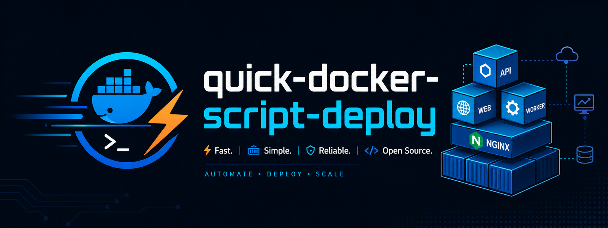

<div align="center">
  <p>
    
  </p>
  <h1>AI API Stack 一键部署脚本</h1>
  <p><strong>Docker / nginx / new-api / newapi-v2 / cli-proxy-api / sub2api / gpt-image-2-webui / gemini-image-desk / dufs / PostgreSQL / Redis</strong></p>
  <p>一个交互式 Shell 脚本，从 Docker 环境准备到服务部署、证书、更新和 Nginx 运维都集中到一个入口。</p>
  <p>
    
    
    
    
  </p>
  <p>
    
    
    
    
  </p>
</div>

---

## 1. 脚本说明

`one-click/deploy.sh` 是一个面向 Docker Compose 的一键部署和运维脚本，主要用于部署 `nginx`、旧版 `new-api`、新版 `newapi-v2`、`cli-proxy-api`、`sub2api`、`gpt-image-2-webui`、`gemini-image-desk` 和 `dufs` 静态文件服务。

- Linux 通用安装/检查 Docker，优先使用 Docker 官方软件源，必要时可回退到官方 `get.docker.com` 便捷脚本
- 固定使用 `/opt/ai-api-stack/` 作为安装和运维目录
- 自动生成根 `docker-compose.yml`、`.env`、`nginx/conf.d/default.conf` 和各服务独立 Nginx 配置
- 根 `docker-compose.yml` 只包含本次选择的服务；每个已选服务目录内也会生成对应的 `docker-compose.yml`
- 旧版 `new-api` 自动带 PostgreSQL 和 Redis
- 新版 `newapi-v2` 使用 `tannic666/newapi:latest`，自动带独立 PostgreSQL 和 Redis
- `sub2api` 自动带独立 PostgreSQL 和 Redis
- 支持部署 `gpt-image-2-webui`，默认可通过 Docker 内网连接 New API
- 支持部署 `gemini-image-desk`，镜像为 `tannic666/gemini-image-desk:latest`
- 支持部署 `dufs`，用于图片、HTML、压缩包等静态资源直链和浏览器上传
- Sub2API、GPT Image WebUI、Gemini Image Desk、Dufs 等应用容器默认加入同一个 `public-net`，外部网络名默认是 `app-net`
- 支持局域网部署和公网域名部署
- 支持公网 HTTPS、80 跳转 443、共用证书
- 支持 acme.sh + 阿里云 DNS API 或手动 DNS TXT 签发泛域名证书，并在后续 HTTPS 配置中自动复用上次证书文件名
- 支持按需配置 Docker 国内镜像源
- 支持更新镜像、重建容器、Nginx 测试/重载/重启/日志

## 2. 推荐顺序

全新的 Linux 服务器建议按这个顺序来：

```text
1. 安装/检查 Docker
2. 申请 HTTPS 证书，公网 HTTPS 才需要
3. 一键部署服务
4. 后续按需更新、管理 Nginx 或卸载
```

对应命令：

```bash
bash one-click/deploy.sh docker
bash one-click/deploy.sh cert
bash one-click/deploy.sh deploy
```

如果服务器已经装好 Docker，可以直接从证书或部署步骤开始。

Docker 国内镜像源不是必须步骤，只有拉取镜像慢或失败时再配置。

## 3. 快速开始

### 3.1 在线一键执行

如果服务器能访问 GitHub，可以直接拉取最新脚本执行：

```bash
curl -fsSL https://raw.githubusercontent.com/JunWan666/quick-docker-script-deploy/main/one-click/deploy.sh -o /tmp/deploy.sh && bash /tmp/deploy.sh
```

也可以直接进入指定功能，例如先安装 Docker：

```bash
curl -fsSL https://raw.githubusercontent.com/JunWan666/quick-docker-script-deploy/main/one-click/deploy.sh -o /tmp/deploy.sh && bash /tmp/deploy.sh docker
```

如果你在局域网里临时提供脚本文件，也可以使用局域网地址：

```bash
curl -fsSL http://192.168.11.6:7878/one-click/deploy.sh -o /tmp/deploy.sh && bash /tmp/deploy.sh
```

不推荐 `curl ... | bash`，交互式菜单需要直接读取终端输入，管道执行在部分 SSH 环境里会卡住或跳过主菜单。

### 3.2 本地执行

在任意目录运行都可以，脚本会固定把部署文件和数据写到 `/opt/ai-api-stack`：

```bash
bash one-click/deploy.sh
```

### 3.3 主菜单

主菜单会显示：

```text
1  通用安装/检查 Docker
2  SSL 证书 / acme.sh
3  一键部署
4  更新服务镜像/容器
5  Nginx 管理
6  Docker 国内镜像源
7  卸载部署
8  杂项
9  退出
```

不带参数启动时会停留在主菜单中；选择某个功能执行完成后会自动返回主菜单。带参数执行时，例如 `bash one-click/deploy.sh docker`，只执行该功能一次并退出。

也可以直接指定功能：

```bash
bash one-click/deploy.sh docker
bash one-click/deploy.sh cert
bash one-click/deploy.sh deploy
bash one-click/deploy.sh update
bash one-click/deploy.sh nginx
bash one-click/deploy.sh mirror
bash one-click/deploy.sh misc
bash one-click/deploy.sh uninstall
```

## 4. 功能教程

### 4.1 通用安装 Docker

运行：

```bash
bash one-click/deploy.sh docker
```

这个菜单会：

- 检查当前 Docker 和 Docker Compose 状态
- 识别当前 Linux 发行版和架构
- Debian / Ubuntu 使用 Docker 官方 apt 仓库安装 Docker Engine
- CentOS / RHEL / Fedora 使用 Docker 官方 rpm 仓库安装 Docker Engine
- Rocky / AlmaLinux / Oracle Linux 默认按 CentOS 兼容仓库处理
- 未匹配到内置流程时，可改用 Docker 官方 `get.docker.com` 便捷脚本兜底
- 安装 `docker-ce`、`docker-ce-cli`、`containerd.io`
- 安装 `docker-buildx-plugin` 和 `docker-compose-plugin`
- 启动并设置 Docker 开机自启
- 如果通过 sudo 执行，可选择把当前用户加入 `docker` 组

该步骤需要 `root` 或 `sudo` 权限。

### 4.2 申请 HTTPS 证书

公网 HTTPS 推荐先申请证书，再部署服务。运行：

```bash
bash one-click/deploy.sh cert
```

阿里云 DNS API 推荐流程：

1. 在阿里云 RAM 创建用于 DNS 的用户。
2. 给该用户授权 `AliyunDNSFullAccess` 或等价 DNS 解析权限。
3. 在证书菜单中选择阿里云 DNS 签发。
4. 输入主域名，例如 `774966.xyz`。
5. 选择是否同时签发泛域名 `*.774966.xyz`。
6. 将证书安装到 `/opt/ai-api-stack/nginx/certs/`。
7. 部署公网 HTTPS 时填写生成的证书文件名。

通用手动 DNS 流程：

1. 在证书菜单中选择手动 DNS 签发。
2. 输入主域名，并选择是否同时签发泛域名。
3. 按脚本输出，在 DNS 控制台添加 `_acme-challenge` TXT 记录。
4. 等待 DNS 生效后按回车继续验证。
5. 证书会安装到 `/opt/ai-api-stack/nginx/certs/`。

DNS 方式签发证书不依赖 Nginx 是否已经启动，所以可以先申请证书再部署项目。已经部署过也可以后补证书，然后通过 Nginx 管理菜单重载。

注意：阿里云 DNS API 模式可以由 acme.sh 自动续期；手动 DNS TXT 模式基本通用，但不能无人值守自动续期，每次续期都需要重新添加 TXT 记录。

### 4.3 一键部署服务

运行：

```bash
bash one-click/deploy.sh deploy
```

按提示填写基础信息：

- 安装目录：固定为 `/opt/ai-api-stack`
- Compose 项目名：默认 `ai-api-stack`
- 时区：默认 `Asia/Shanghai`
- 是否加入外部 Docker 网络 `app-net`
- 如果 `app-net` 不存在，是否自动创建

服务选择支持下面这些写法：

```text
all
1
2
1234567
1 2
1,5
new-api sub2api webui newapi-v2 gemini dufs
```

服务编号含义：

```text
Nginx 默认作为统一网关必装，不需要选择。
1 = new-api，自动带 PostgreSQL + Redis
2 = cli-proxy-api
3 = sub2api，自动带独立 PostgreSQL + Redis
4 = gpt-image-2-webui
5 = newapi-v2，新版 NewAPI，镜像 tannic666/newapi，自动带独立 PostgreSQL + Redis
6 = gemini-image-desk，镜像 tannic666/gemini-image-desk
7 = dufs，静态文件/图片/HTML 直链服务，镜像 tannic666/dufs
```

常用选择：

- `all`：部署全部服务
- `1`：只部署 New API，并生成对应 Nginx 入口
- `2`：只部署 CPA / CLIProxyAPI，并生成对应 Nginx 入口
- `3`：只部署 Sub2API，并生成对应 Nginx 入口
- `4`：只部署 GPT Image WebUI，并生成对应 Nginx 入口
- `5`：只部署新版 NewAPI，并生成对应 Nginx 入口
- `6`：只部署 Gemini Image Desk，并生成对应 Nginx 入口
- `7`：只部署 Dufs 静态文件服务，并生成对应 Nginx 入口
- `12`：部署 New API + CPA
- `13`：部署 New API + Sub2API
- `124`：部署 New API + CPA + GPT Image WebUI
- `15`：同时部署旧版 New API + 新版 NewAPI
- `56`：部署新版 NewAPI + Gemini Image Desk
- 域名建议：通用静态资源优先用 `file.774966.xyz`；如果要按用途拆分，也可以让 `img.774966.xyz page.774966.xyz` 和 `file.774966.xyz` 指向同一 Dufs 目录
- `1234567`：部署全部服务

### 4.4 局域网部署

Nginx 默认必装。部署模式输入：

```text
1 = 局域网
2 = 公网
```

默认是 `1`，也就是局域网模式。

局域网模式不需要域名，部署完成后脚本会自动输出类似：

```text
New API: http://服务器局域网IP:端口
CPA:     http://服务器局域网IP:端口
Sub2API: http://服务器局域网IP:端口
WebUI:   http://服务器局域网IP:端口
```

### 4.5 公网 HTTPS 部署

公网模式适合已经准备好域名和证书的服务器。选择：

```text
Nginx 部署模式: 2
是否启用 HTTPS: y
是否 80 端口 301 重定向到 443: y
```

然后填写：

- New API 绑定域名，例如 `774966.xyz www.774966.xyz api.774966.xyz`
- CPA 绑定域名，例如 `admin.774966.xyz`
- Sub2API 绑定域名，例如 `sub.774966.xyz`
- GPT Image WebUI 绑定域名，例如 `image.774966.xyz`
- Dufs 静态文件绑定域名，例如 `file.774966.xyz`；也可以填写 `file.774966.xyz img.774966.xyz page.774966.xyz`
- 是否共用同一张证书
- 证书文件名和私钥文件名

如果此前通过证书菜单签发并安装过证书，部署 HTTPS 时会先询问是否直接复用上次生成的 `fullchain` 和私钥文件名。

生成的 Nginx 配置目录在：

```text
/opt/ai-api-stack/nginx/conf.d/
```

其中 `default.conf` 放公共配置和 HTTP 到 HTTPS 的默认跳转；各服务会生成独立配置，例如 `new-api.conf`、`sub2api.conf`、`webui.conf`。你也可以在该目录下新增自己的 `.conf` 文件，脚本不会删除额外配置。

证书文件默认放在：

```text
/opt/ai-api-stack/nginx/certs/
```

### 4.6 更新服务

更新镜像并重建容器：

```bash
bash one-click/deploy.sh update
```

可以选择全部服务，也可以只更新某几个服务。脚本会执行：

```bash
docker compose pull
docker compose up -d
```

更新完成后可选择是否清理未使用的旧镜像。

### 4.7 Nginx 管理

进入 Nginx 管理菜单：

```bash
bash one-click/deploy.sh nginx
```

支持：

- 测试 Nginx 配置
- 重载 Nginx 配置
- 重启 Nginx 容器
- 启动/拉起 Nginx
- 查看 Nginx 状态
- 查看 Nginx 日志

修改或新增 `/opt/ai-api-stack/nginx/conf.d/` 下的 `.conf` 文件后，可以进入该菜单执行测试和重载。

### 4.8 Docker 国内镜像源

这一步不是必须的。只有拉取 Docker 镜像很慢、超时或失败时再配置。

运行：

```bash
bash one-click/deploy.sh mirror
```

这个菜单会修改：

```text
/etc/docker/daemon.json
```

按提示输入一个或多个 Docker Hub 加速地址，多个地址支持空格或逗号分隔。

```text
https://你的镜像源地址1 https://你的镜像源地址2
```

脚本会写入 `registry-mirrors`，并询问是否立即重启 Docker 使配置生效。

如果想恢复默认源，选择清空镜像源即可。

### 4.9 杂项

运行：

```bash
bash one-click/deploy.sh misc
```

当前包含：

- 启用 Bash/ls 颜色：备份当前用户的 `~/.bashrc`，启用常见颜色配置，并追加幂等的颜色配置块。

修改后脚本会自动执行 `source ~/.bashrc`。包括 root 在内，如果脚本是普通方式执行，子进程无法直接修改父级 SSH Shell，脚本会自动进入一个已加载配置的新 Bash；输入 `exit` 可回到原来的 Shell。

### 4.10 卸载部署

卸载：

```bash
bash one-click/deploy.sh uninstall
```

脚本会尝试执行：

```bash
docker compose down -v --remove-orphans
```

然后询问是否删除安装目录和配置文件。

## 5. 安装目录结构

部署后会按所选服务生成。`nginx` 是默认网关，会始终生成；未选择的业务服务不会创建对应目录或 Compose 服务块。
实际启动仍以根目录 `docker-compose.yml` 为入口；服务目录内的 `docker-compose.yml` 用于查看和维护对应模块，复用根目录 `.env`。

```text
/opt/ai-api-stack/
├── docker-compose.yml          # 实际部署入口，只包含本次选择的服务 + nginx
├── .env                        # 只写入本次选择服务需要的变量 + nginx 变量
├── acme-reload-nginx.sh   # 证书菜单生成，可选
├── new-api/                    # 选择 1 时生成
│   ├── docker-compose.yml
│   ├── data/
│   └── logs/
├── newapi-v2/                  # 选择 5 时生成
│   ├── docker-compose.yml
│   ├── data/
│   └── logs/
├── cliproxyapi/                # 选择 2 时生成
│   ├── docker-compose.yml
│   ├── auths/
│   ├── logs/
│   └── config.yaml
├── sub2api/                    # 选择 3 时生成
│   ├── docker-compose.yml
│   └── data/
├── gpt-image-2-webui/          # 选择 4 时生成
│   ├── docker-compose.yml
│   ├── generated-images/
│   └── logs/
├── gemini-image-desk/          # 选择 6 时生成
│   └── docker-compose.yml
├── dufs/                       # 选择 7 时生成
│   ├── docker-compose.yml
│   └── data/                   # 默认静态文件目录，直链访问这里的文件
└── nginx/
    ├── docker-compose.yml
    ├── certs/
    └── conf.d/
        ├── default.conf          # 公共 Nginx 配置、gzip、HTTP 跳 HTTPS
        ├── new-api.conf          # 选择 1 时生成
        ├── cliproxyapi.conf      # 选择 2 时生成
        ├── sub2api.conf          # 选择 3 时生成
        ├── webui.conf            # 选择 4 时生成
        ├── newapi-v2.conf        # 选择 5 时生成
        ├── gemini-desk.conf      # 选择 6 时生成
        └── dufs.conf             # 选择 7 时生成
```

## 6. 注意事项

- Docker 安装菜单优先使用官方软件源；未内置的 Linux 发行版可选择 Docker 官方 `get.docker.com` 便捷脚本兜底。
- 配置 Docker 镜像源会修改 `/etc/docker/daemon.json`。
- Nginx 默认必装；New API、CPA、Sub2API、GPT Image WebUI、Gemini Image Desk 和 Dufs 默认不暴露宿主机端口，只通过 Nginx 代理访问。
- PostgreSQL 和 Redis 是旧版 New API / 新版 NewAPI / Sub2API 的依赖，不需要在服务选择里单独选择。
- New API、CPA、Sub2API、GPT Image WebUI、Gemini Image Desk 和 Dufs 应用容器都会加入 `public-net`；默认情况下它对应外部 Docker 网络 `app-net`。
- Sub2API 的 PostgreSQL 和 Redis 只加入独立内部网络，不暴露给宿主机。
- GPT Image WebUI 的 `generated-images/` 和 `logs/` 会自动设置为容器可写，避免非 root 容器用户写入图片时报权限错误。
- Dufs 默认目录是 `/opt/ai-api-stack/dufs/data`，匿名用户可直链读取文件，管理员登录后可上传和删除文件。
- `SESSION_SECRET` 和 `CRYPTO_SECRET` 是 New API 内部密钥，不是后台登录密码。
- 阿里云 `Ali_Key` / `Ali_Secret` 不要公开，泄露后请立即禁用或轮换。
- 手动 DNS TXT 签发证书不绑定域名服务商，但不能无人值守自动续期；生产环境长期使用推荐 DNS API 模式。
- 公网 HTTPS 推荐使用泛域名证书，New API、CPA、Sub2API、GPT Image WebUI、Gemini Image Desk 和 Dufs 可以共用同一张证书。
- 重新部署时脚本会重写 `default.conf` 和本次选择服务对应的 Nginx 配置；自定义站点建议单独放到其他 `.conf` 文件。

## 7. 开源许可

本项目基于 [MIT License](LICENSE) 开源。
